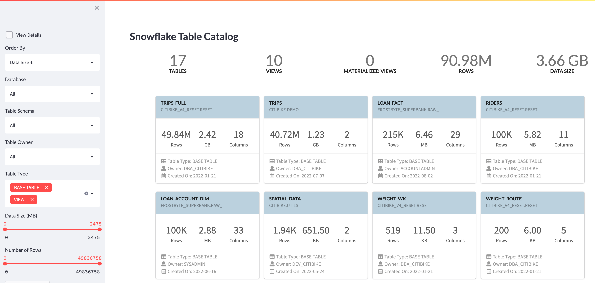

# Snowflake Table Catalog with Streamlit
This is a streamlit demo application that visualizes the table metadata from SNOWFLAKE database and helps exploring tables.

Snowflake provides a system-defined, read-only shared database named SNOWFLAKE that contains metadata, as well as historical usage data, about the objects in your organization and accounts. This database provides information about your tables as well. 

Whenever you want to understand your tables, you can query these tables directly and get the required information. On the other hand, you can use streamlit to create applications to monitor usage or metadata from Snowflake.

Enjoy this online demo application hosted in Streamlit cloud with demo data.
https://snow-table-catalog.streamlit.app/





## Prepare Your Application

Set up credentials. Create a file .streamlit/secrets.toml and fill in your Snowflake account credentials. The file should look like this:

```
[snowflake]
user = "..."
password = "..."
account = "..."
warehouse = "..."
role = "..."
```

Role should have access to Snowflake Account_Usage Database and Schema.


## Run Your Application
```
streamlit run snowflake-table-catalog.py

```
or 

```
python -m streamlit run snowflake-table-catalog.py

```

Edit: Application was tested with Streamlit 1.11.1 and Snowflake Python Connector 2.7.7.
